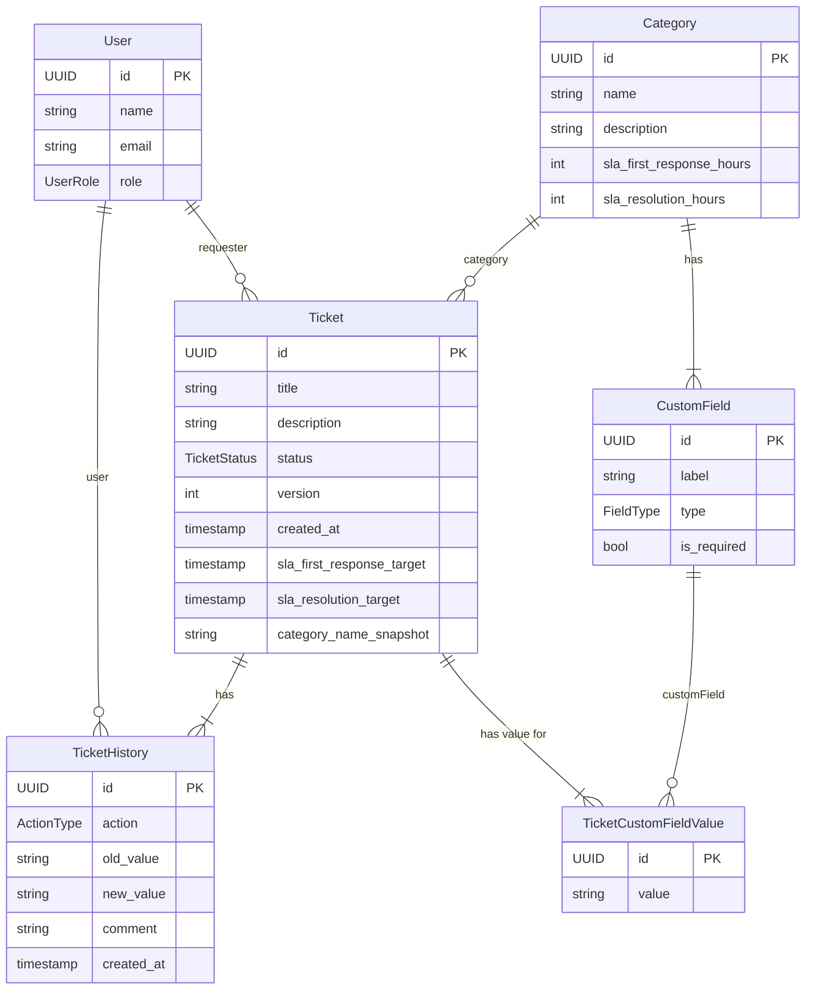

# Diagrama de Entidad-Relación de la Base de Datos

Este documento contiene el diagrama de la base de datos para ServiceDesk Pro, generado en formato Mermaid. El diagrama refleja la estructura de las entidades de TypeORM definidas en el backend.

### Tipos de Enumeración (Enums)

- **UserRole:** `requester`, `agent`, `manager`
- **FieldType:** `text`, `textarea`, `select`
- **TicketStatus:** `open`, `in_progress`, `resolved`, `closed`
- **ActionType:** `ticket_created`, `status_change`, `comment_added`