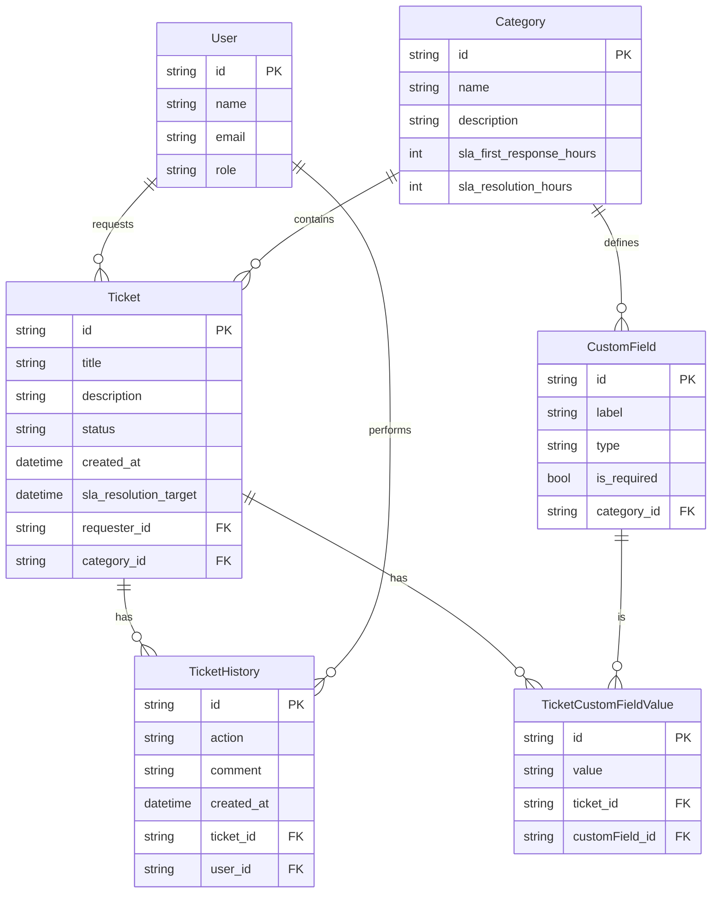

# Diagrama de Entidad-Relación de la Base de Datos

Este documento contiene el diagrama de la base de datos para ServiceDesk Pro, generado en formato Mermaid a partir de las entidades de TypeORM del backend.

